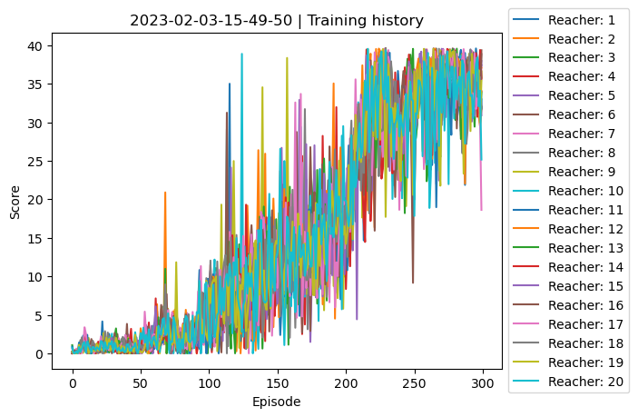
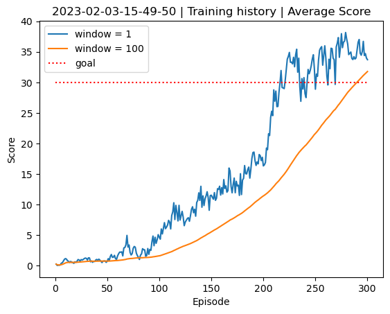

# Implementation

## Environment
Using 20 agents instead of just 1 agent helps reduce correlation in the 'Replay Buffer', which is a key component in the training process of the Deep Reinforcement Learning Agent. The 'Replay Buffer' stores experiences from the environment, which the agent uses to learn from. If the experiences in the buffer are too similar, the agent will not be exposed to a wide range of situations and may not learn effectively. By having 20 agents, each with their own environment, the experiences stored in the 'Replay Buffer' will be more diverse, reducing the correlation between them and improving the learning process. Additionally, using the "update after 20 steps" method allows the agent to collect more diverse experiences in a shorter amount of time, further reducing correlation.

## Deep Deterministic Policy Gradient
The agent learns by using the 'Deep Deterministic Policy Gradient' (DDPG) algorithm. This algoritm is designed for continuous action spaces and uses soft updates. Unlike the 'Deep Q Network' (DQN) algorithm, which has a discrete action space, the DDPG output layer has only 4 nodes instead of hundreds or thousands, as the action space is not discretized. Soft updates also help to reduce correlations. The implementation is similar to the two-neural-network setup of DQN, but instead of occasionally updating the target network, soft updates frequently update the network but with a small fraction of the weights.

## Actor-Critic
The Deep Deterministic Policy Gradient (DDPG) algorithm uses an actor-critic architecture because it combines the benefits of both value-based and policy-based reinforcement learning methods. The 'Actor' network outputs a deterministic policy, mapping states to actions, and the 'Critic' network evaluates the quality of the policy, providing the 'Actor' with a gradient signal for improvement. The combination of the 'Actor' and 'Critic' allows for better stability and convergence in learning and improved performance in challenging environments.

The 'Actor' model is designed to have low bias but high variance in order to avoid falling into local maxima, which are suboptimal solutions. The 'Critic' model on the other hand, is designed to have low variance and high bias in order to speed up learning. This is because the 'Critic' model is used to estimate the value function, which is a measure of how good a certain state-action pair is. A low variance in the 'Critic' model allows it to converge faster to the true value function, while a high bias ensures that it is more accurate.

## Neural network architecture
The deep learning network architectures of both the 'Actor' an 'Critic' are quite similar. However the 'Critic' network is responsible for evaluating the quality of the actions taken by the 'Actor' network. Therefore the 'Critic' network needs to take both the current state and the action taken by the 'Actor' as inputs, in order to produce a scalar (linear) value as output. This value is an "quality" indicator of how good the 'Actor' is performing.

|                    | Actor               | Critic                           |
| ------------------ | ------------------- | -------------------------------- |
| Input layer (fc1)  | 33 features (relu)  | 33 features (relu)               |
| Hidden layer (fc2) | 400 features (relu) | 400 + 4 (action) features (relu) |
| Hidden layer (fc3) | 300 features(relu)  | 300 features (relu)              |
| Output layer       | 4 features (tanh)   | 1 features (linear)              |

## Ornstein-Uhlenbeck noise
Ornstein-Uhlenbeck noise is a type of stochastic noise that is used to encourage exploration in reinforcement learning. This noise is added to the action taken by the agent, so that the agent explores different parts of the state space instead of getting stuck in a single region. The mean of the Ornstein-Uhlenbeck process is determined by the current action, and the variance determines how much random noise is added to the action. By using this type of noise, the agent can balance exploration and exploitation in a way that helps to speed up the learning process.

### Training
Here is an example of the initial agent that makes random decisions each time.

The agent is set to train for 500 episodes, where in each episode 1000 timesteps will be made. As mentioned before, every 20th timestep the agent will sample from the replay buffer and update the target 'Actor' and 'Critic' for futher improvements.

The training progress looked as follows.

At episode 100 the scores of each agent started to climb to approximatly 35 and stayed there. Now let's take a look at the averages.

The average scores (blue line) climbs much more steeply but is also much more irregularly. If we average over a window (100), the climb is less steep but more stable, and stays above 30.

Here is my trained agent in action.

### Hyperparameters
The model was trained many times over, each time the hyperparameters where shifted slightly. In the beginning i kept a close eye on the incrementation of the average score (during training). Once i was confident that the agent was generating scores, i kept playing with different hyperparameter settings. In the end, the most that helped whas more episodes with a larger amount of timestemps.

## Future Work
Some considerations that could help are:
- Reduce the learning rate, when the loss isn't decreasing suffucient (similar to [ReduceLROnPlateau](https://keras.io/api/callbacks/reduce_lr_on_plateau/))
- Early stopping, futher training episodes (similar to [early_stopping](https://keras.io/api/callbacks/early_stopping/))
