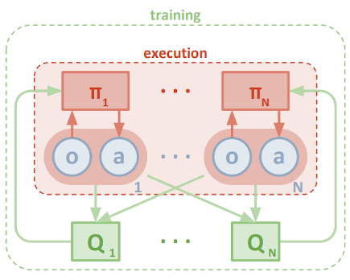

# Implementation

## Environment
The tennis environment is controlled by the unity engine. I have no control over the environment, the only input (in the environment) I can give is an action for both the players. If the ball hits the ground or get's out-off-bounds, the game is over.

### Goal
The goal of this assignment is, to train an multi agent that controls both players. The multi agent must adchieve an average score (of both agents) of 0.5 over 100 consecutive episodes. Because the goal is a reward for both agents, it means that it's not an player individual score, and thus players don't play to win, but they collaborate to get the longest matches. 

### State space
The multi agent recieves an state from the environment. The state space consists of 8 variables, these variables correspond to the velocity and position of the ball as well of the rackets. The unity environment stacks 3 states, resulting in a vector of (3 * 8) 24 variables.

### Action space
Based on the given state, the multi agent must decide wich action to take for each player. Each action of the player consists of 2 continuous values:
- horizontal movement (ranging from -1 to 1), where -1 is towards the net, and vise versa.
- vertical movement (ranging from -1 to 1), where -1 is down and vise versa.

# Training
For the training of the multi agent i've used an off-policy method called MADDPG (Multi Agent Deep Deterministic Policy Gradient). I've split the MADDPG method in an MA (Multi Agent) part and a DDPG (Deep Deterministic Policy Gradient) part. The multi agent is used for both training and inferencing, while the DDPG is solely used for training the multi agent.

## Deep Deterministic Policy Gradient
The agent learns by using the Deep Deterministic Policy Gradient (DDPG) algorithm. This algoritm is designed for continuous action spaces and uses soft updates, unlike the Deep Q Network (DQN) algorithm, which has a discrete action space. Soft updates also help to reduce correlations. The implementation is similar to the two-neural-network setup of DQN, but instead of occasionally updating the target network, soft updates frequently update the network but with a small fraction of the weights.

## Multi agent
The multi agent controls 2 agents (1 for each player). It contains a central memory (buffer) where all the experiences (states, actions, rewards, next_states, dones) are stored. The multi agent **act**s on a given state by letting each agent decide which action to take. During training the multi agent takes a **step** where it takes a sample batch from the memory let the (player) agents learn from the batch.

The multi agent adopts a centralized training and decentralized execution policy. This means that during training the (agent) critics have access to all (states & actions) the information (memory), whilist durint execution the (agent) actors only have access to their own information.

## Neural network architecture
Each agent contains an actor and critic network. The deep learning network architectures of both the actor an critic are quite similar. However the critic network is responsible for evaluating the quality of the actions taken by the actor network. Therefore the critic network needs to take both the current state and the action taken by the actor as inputs, in order to produce a scalar (linear) value as output. This value is an "quality" indicator of how good the Actor is performing.

Both networks are fairly simple.

|                    | Actor                         | Critic                               |
| ------------------ | ----------------------------- | ------------------------------------ |
| Input layer (fc1)  | (state_size) features (relu)  | (state_size) features (relu)         |
| Hidden layer (fc2) | 256 features (relu)           | 256 + (actions_size) features (relu) |
| Hidden layer (fc3) | 128 features(relu)            | 128 features (relu)                  |
| Output layer       | (action_size) features (tanh) | 1 features (linear)                  |

### Hyperparameters
If put the hyperparameters in 1 config file (`./assets/config.ini`). I found it conveniant to have all the parameters in 1 place and i can use them in multiple places.
- **default**
  - `seed`: A random seed.
  - `batch_size`: The size of the batch (minibatch) of played episodes (experiences).
  - `learn_episode`: The episode when to start learning.
- **buffer**
  - `size`: The size of the replay buffer.
- **ddpg**
  - `episodes`: How many epsiodes (matches) to play.
  - `target_score`: The target score i have to adchieve / surpass.
  - `target_window`: How many consecutive episodes to adchieve the target score.
- **multi_agent**
  - `tau`: For soft updating the agent networks.
  - `repeat`: The number of time to repeat the learning (per step).
- **agent**
  - `gamma`: The discount factor.
  - `lr_actor`: The learning rate of the actor.
  - `lr_critic`: The learning rate of the critic.
  - `weight_decay`: The decay function of the critic optimizer.
  - `reduction_rate`: The ratio to reduce the noise.
  - `reduction_ratio`: The initial ratio to reduce the noise.
  - `reduction_end`: The threshold to stop reducing the noise.
- **noise**
  - `mu`: (Ornstein-Uhlenbeck) noise parameter.
  - `theta`: (Ornstein-Uhlenbeck) noise parameter.
  - `sigma`: (Ornstein-Uhlenbeck) noise parameter.
- **actor**
  - `fc1_units`: Number of units of the first layer (after the input layer) of the actor network.
  - `fc2_units`: Number of units of the second layer of the actor network.
- **critic**
  - `fc1_units`: Number of units of the first layer (after the input layer) of the critic network.
  - `fc2_units`: Number of units of the second layer of the critic network.

### Progress
I started this assignment with the same code from the previous Udacity project (p2_continuous-control > reacher). I was aware that that setup was a ddpg setup for a single agent. So after some tweaking i got 2 separate agents up-and-training. The next step for me was to generalize the code so that the replay buffer is used over both agents, and that both agents learns from the same memory (replay buffer).

I've made a convenience script (`__train_agents.py`), that allowed me to quickly train the multi agent. I've implemented the `tqdm` library to show a progress bar (of the episodes), which also displays the average score. This gave me direct feedback on the training progress and the intermediate score. I've lowered the [ddpg > episodes] to that i could quickly itterate with different hyperparameters and code changes and monitor progress. I noticed that started learning later (not from the first episodes) helped to get higher average scores faster. I've noticed that if add some standard (normal distributed) noise to the action and slowly decrease it during training, it improves the progress.

Lastly i've also implemented a plotly visualisation, this helped me to create an interactive graph which helped me to digg a little deeper into the scores.

This plot shows the mean scores for each agent (in blue and red), and the mean of both agents per episode (in green). I've also added a rolling mean (in purple) with a window size of 100, and a horizontal dotted line at 0.5 which is the target score.

It's a little hard to see (from the static plot = ./assets/scores.png), but i've surpassed the target score at episode **1119**. That's where the interactive plot (./assets/scores.html) is more helpfull.

The ddpg code creates a snapshot at every 100 episodes and when the target score is adchieved. The snapshot consist of:
- The agents scores so far. These are located in the subfolder `./data`.
- The training history graph (in png and html). These are located in the subfolder `./assets`.
- The checkpoints of the model. These are located in the subfolder `./checkpoints`.

## Future Work
- I've trained the model on my local hardware (i find it more conveniant). My hardware doesn't have an Nvidia GPU, so utilizing CUDA was a no-go, i've tried to setup Pytorch so that it uses my macbook M1 chip, but that didn't pan out. So eventually the training took place on the GPU, which took almost 1.5 day.
- The multi agent now draws a random sample batch from the memory (replay buffer). I could improve here by using a weighted sampling. After heaving learned from a sample, i could keep track of the used samples and expand them with the reward. After some time i could prioritize the samples with lower rewards, and thus making less errors faster.
- I would also experiment with different policiy strategies like, Proximal Policy Optimization.

# Results
Here is a video of running the entire notebook, if commented the training part out (it would be a long video otherwise). First you'll see the a match where the code takes random actions. Then the multi agent is loaded and it decides which action to take. You'll see that the multi agent first makes 2 mistakes (the ball goes out-off-bounds) but then it takes off and the next 3 matches are very stable (and boring if you'll ask me). Notice that the max score (in the notebook) averages around 2.65, which is consistent with the training graph.

