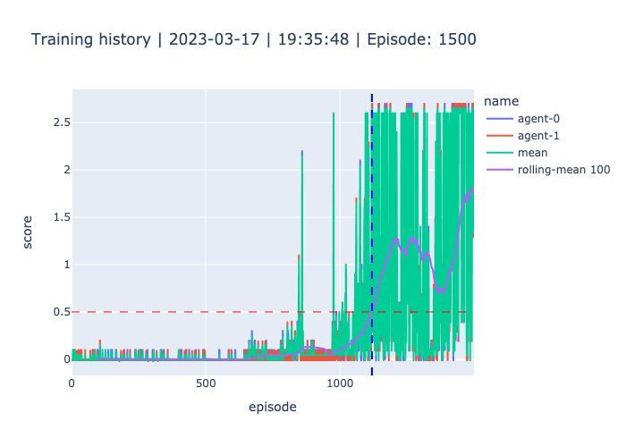

# Implementation

## Environment
The tennis environment is controlled by the unity engine. I have no control over the environment, the only input (in the environment) I can give is an action for both the players. If the ball hits the ground or get's out of bounds, the game is over.

### Goal
The goal of this assignment is, to train an `multi agent` that controls both players. The `multi agent` must adchieve an average score (of both agents) of 0.5 over 100 consecutive episodes. Because the goal is a reward for both agents, it means that it's not an player individual score, and thus players don't play to win, but they collaborate to get the longest matches. 

### State space
The `multi agent` recieves an state from the environment. The state space consists of 8 variables, these variables correspond to the velocity and position of the ball as well of the rackets. The unity environment stacks 3 states, resulting in a vector of (3 * 8) 24 variables.

### Action space
Based on the given state, the `multi agent` must decide wich action to take for each player. Each action of the player consists of 2 continuous values:
- horizontal movement (ranging from -1 to 1), where -1 is towards the net, and vise versa.
- vertical movement (ranging from -1 to 1), where -1 is down and vise versa.

# Training
For the training of the `multi agent` i've used an off-policy method called MADDPG (Multi Agent Deep Deterministic Policy Gradient). I've split the MADDPG method in an MA (Multi Agent) part and a DDPG (Deep Deterministic Policy Gradient) part. The `multi agent` is used for both training and inferencing, while the DDPG is solely used for training the `multi agent`.

## Deep Deterministic Policy Gradient
Let's start with the DDPG. 

### Hyperparameters
If put the hyperparameters in 1 config file (`./assets/config.ini`). I found it conveniant to have all the parameters in 1 place and i can use them in multiple places.
- **default**
 - `seed`: A random seed.
 - `batch_size`: The size of the batch (minibatch) of played episodes (experiences).
 - `learn_episode`: The episode when to start learning.
- **buffer**
 - `size`: The size of the replay buffer.
- **ddpg**
 - `episodes`: How many epsiodes (matches) to play.
 - `target_score`: The target score i have to adchieve / surpass.
 - `target_window`: How many consecutive episodes to adchieve the target score.
- **multi_agent**
 - `tau`: For soft updating the agent networks.
 - `repeat`: The number of time to repeat the learning (per step).
- **agent**
 - `gamma`: The discount factor.
 - `lr_actor`: The learning rate of the actor.
 - `lr_critic`: The learning rate of the critic.
 - `weight_decay`: The decay function of the critic optimizer.
 - `reduction_rate`: The ratio to reduce the noise.
 - `reduction_ratio`: The initial ratio to reduce the noise.
 - `reduction_end`: The threshold to stop reducing the noise.
- **noise**
 - `mu`: (Ornstein-Uhlenbeck) noise parameter.
 - `theta`: (Ornstein-Uhlenbeck) noise parameter.
 - `sigma`: (Ornstein-Uhlenbeck) noise parameter.
- **actor**
 - `fc1_units`: Number of units of the first layer (after the input layer) of the actor network.
 - `fc2_units`: Number of units of the second layer of the actor network.
- **critic**
 - `fc1_units`: Number of units of the first layer (after the input layer) of the critic network.
 - `fc2_units`: Number of units of the second layer of the critic network.

### Progress
I started this assignment with the same code from the previous Udacity project (p2_continuous-control > reacher). I was aware that that setup was a ddpg setup for a single agent. So after some tweaking i got 2 separate agents up-and-training. The next step for me was to generalize the code so that the replay buffer is used over both agents, and that both agents learns from the same memory (replay buffer).

I've made a convenience script (`__train_agents.py`), that allowed me to quickly train the multi agent. I've implemented the `tqdm` library to show a progress bar (of the episodes), which also displays the average score. This gave me direct feedback on the training progress and the intermediate score. I've lowered the [ddpg > episodes] to that i could quickly itterate with different hyperparameters and code changes and monitor progress. I noticed that started learning later (not from the first episodes) helped to get higher average scores faster. I've noticed that if add some standard (normal distributed) noise to the action and slowly decrease it during training, it improves the progress.

Lastly i've also implemented a plotly visualisation, this helped me to create an interactive graph which helped me to digg a little deeper into the scores.

This plot shows the mean scores for each agent (in blue and red), and the mean of both agents per episode (in green). I've also added a rolling mean (in purple) with a window size of 100, and a horizontal dotted line at 0.5 which is the target score.

It's a little hard to see (from the static plot = ./assets/scores.png), but i've surpassed the target score at episode **1119**. That's where the interactive plot (./assets/scores.html) is more helpfull.

## Future Work
...
- I've trained the model on my local hardware (i find it more conveniant). My hardware doesn't have an Nvidia GPU, so utilizing CUDA was a no-go, i've tried to setup Pytorch so that it uses my macbook M1 chip, but that didn't pan out. So eventually the training took place on the GPU, which took almost 1.5 day.

# Results

